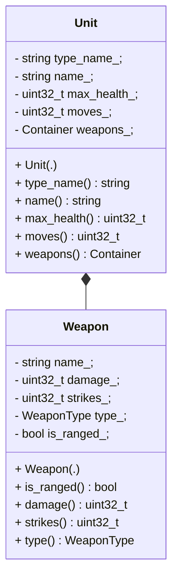

# Unit Browser for a Mythical Game

## Overview

To represent the units and weapons shown in the GUI, you need to implement the required classes for storing the units' data. You may implement any class hierarchy that will fulfill the needs of storing and making accessible the relevant information. You're also free to select the data types that you deem best for the individual pieces of information. The diagram below offers one possible approach.

## Architecture

The following class diagram provides an overview of the primary classes used in the project. This should give you a good starting point for understanding the software architecture.



# Prerequisites

Before you proceed with building or contributing to this project, ensure you have the following software installed on your system:

- C++ compiler supporting C++11 or above
- CMake, version 3.10 or higher
- wxWidgets for GUI functionalities
- Catch2 for running unit tests

## Installing Dependencies

### C++ Compiler (GCC or Clang)

To install a C++ compiler such as GCC or Clang on Linux:

#### For GCC:

```bash
sudo apt-get install build-essential
```

#### For Clang:

```bash
sudo apt-get install clang
```

### CMake

To install CMake:

```bash
sudo apt-get install cmake
```

### wxWidgets

wxWidgets is used in this project to provide the graphical user interface. You can install it on Linux-based operating systems using the package manager as follows:

```bash
sudo apt-get install libwxgtk3.0-dev
```
### Catch2

Catch2 is used for unit testing in this project. To install it on Linux-based systems that support the `apt-get` package manager, run the following command:

```bash
sudo apt-get install catch2
```

# Build Instructions

## Clone the Repository

To get started with the project, you'll first need to clone the repository to your local machine. Follow these steps:

1. **Clone the Repository:** Open your terminal and execute the following command to clone the repository. Replace `repository-url` with the actual URL of the repository.

    ```bash
    git clone repository-url
    ```

2. **Navigate to the Repository Directory:** After cloning, navigate into the repository directory to access the project files.

    ```bash
    cd repository-name
    ```

Now, you should be inside the directory containing the project files.

## Configure and Build using CMake
1. **Create a Build Directory:** Navigate to the root directory of the project and create a new directory for the build.

    ```bash
    mkdir build
    ```

2. **Navigate to Build Directory:**

    ```bash
    cd build
    ```

3. **Run CMake:** Generate the Makefile using CMake.

    ```bash
    cmake ..
    ```

4. **Compile the Project:** Finally, compile the code.

    ```bash
    make
    ```

  This will build the project in the `build` directory.

# Running the Program

After successfully building the project, you'll find the executable in the `build` directory (or the directory where you've built the project). Follow these steps to run the program:

1. **Navigate to the Build Directory:** If you are not already there, navigate to the `build` directory where the executable is located.

    ```bash
    cd path/to/build/directory
    ```

2. **Run the Executable:** The executable's name will depend on how you've configured your project. Let's assume the executable is named `MythicalGameUnitBrowser`.

    ```bash
    ./mythical_game
    ```
# Running Unit Tests

The project also includes a suite of unit tests to ensure that everything is working as expected. These tests are built along with the project and can be found in the `build` directory.

1. **Navigate to the Build Directory:** If you are not already there, navigate to the `build` directory where the `unit_test` executable is located.

    ```bash
    cd path/to/build/directory
    ```

2. **Run the Unit Tests:** Execute the `unit_test` binary to run all unit tests.

    ```bash
    ./unit_test
    ```

If all tests pass, you're good to go! If any tests fail, please refer to the test output for diagnostic information. You can also report the issue on GitHub.


# User Guide for GUI Controls

In this section, you'll find information on how to use the controls of the graphical user interface for the Mythical Game Unit Browser.

### Navigating the GUI


### Keybindings


### Other Actions

