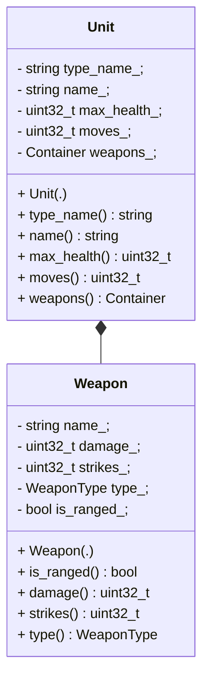

# Unit Browser for a Mythical Game

To represent the units and weapons shown in the GUI, you need to implement the
required classes for storing the units' data. You may implement any
class hierarchy that will fulfill the needs of storing and making accessible
the relevant information. You're also free to select the data types that you
deem best for the individual pieces of information.
The diagram below offers one possible approach.

